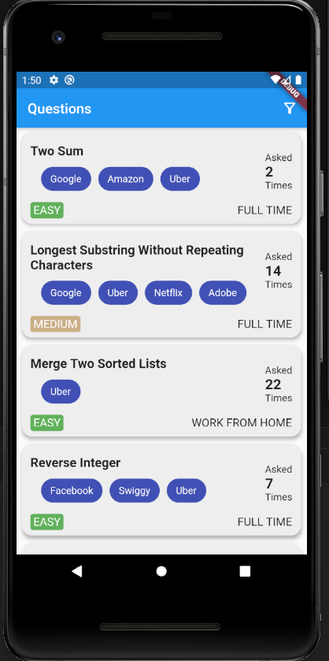
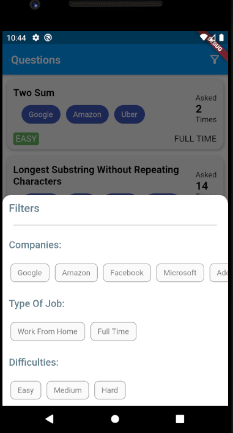

# Question Search

A FLutter application made for the screening process for the internship at Demux Academy

## Getting Started

The assignment involved testing the following
- ListViews
- Fetching Data from a Backend
- Implement a Good UI
- Filter List based on some criteria

### Some Screens

| Screen 1      | Screen 2
|---   	|---   	
| |
