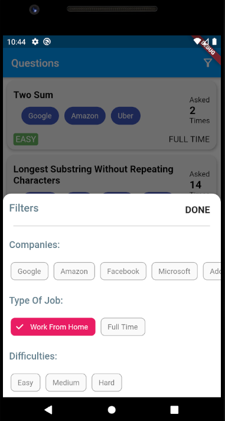

# Question Search

A FLutter application made for the screening process for the internship at Demux Academy

## Some Points that have been kept in mind

The assignment involved testing the following
- ListViews
- Fetching Data from a Backend
- Implement a Good UI
- Filter List based on some criteria
- Demo API can be found [Here](http://gtxtreme.me/static/scratch.json)

**Demo API structure**
```
{
    "id": "1",
    "title": "Two Sum",
    "frequency": "2",
    "tags": {
      "difficulty": "easy",
      "company": [
        "Google",
        "Amazon",
        "Uber"
      ],
      "type": "Full Time",
      "trendscore": "10"
    }
  },
```

<hr>

### Some Screens

| Screen 1      | Screen 2 | Screen 3
|---   	|---  |---
| ||


### Download
Download the latest release from [Here](apk/latest-release.apk)
